# About
This repo contains my isro internship project insights

### Tools and Technologies used
  
  
  
  
  
  

### Table of Contents
1) [Login](#login)
2) [Dashboard](#dashboard)
3) [Register Candidate](#register-candidate)
4) [View Candidate](#view-candidate)
5) [View Detailed Candidate](#details-of-candidate)
6) [Edit Candidate](#edit-candidate)
7) [Update Candidate](#update-candidate)
8) [Assign Exam Date](#assign-exam-date)
9) [Payment module ](#enter-payment)
10) [View Payments](#payment-details)
11) [Search Feature](#search)
12) [View Searched Candidate](#view-searched-candidate)
13) [Upload Result](#upload-result)
14) [Upload Memo](#upload-memo)
15) [Remaining Memo List](#upload-memo-page)
16) [Download Memo](#download-memo)
17) [Assign Outward Number](#assign-id)
18) [Internship Certificate](#internship-certificate)

## Login

 From this page, scientists will be able to login to our HRMCS portal, Inorder to register themselves, they have to contact admin section.
 
 

## Dashboard

 Created and developed this fabulous customisable dashboard with chartJS (library) and some css ingredients.
 
 

## Register Candidate

 Candidate form to add incoming outsourced candidates for the exam/training.
 
 

## View Candidate

 This table created directly in servlet using SQL Query to view details of entered Candidate.
 
  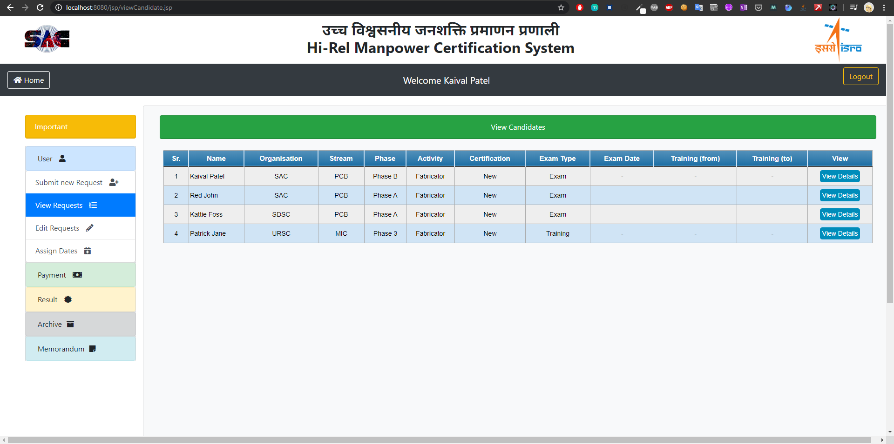

## Details of Candidate

 This table created directly in servlet using SQL Query to view details of entered Candidate.
 
  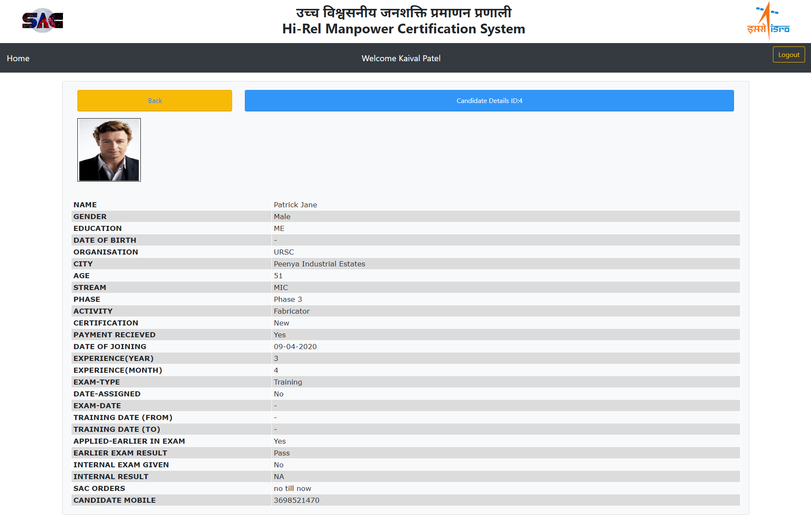

## Edit Candidate

 This table created directly in servlet using SQL Query to edit and delete the details of entered Candidate.
 
  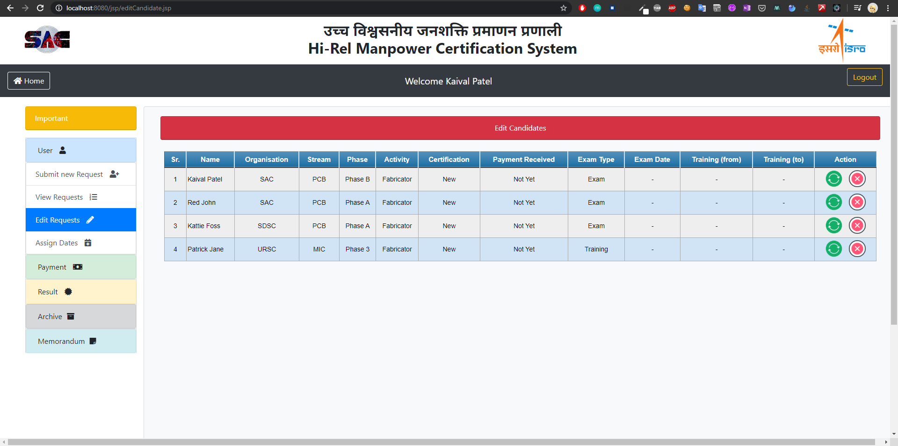

## Update Candidate

 This table created directly in servlet using SQL Query to update the details of entered Candidate.
 
  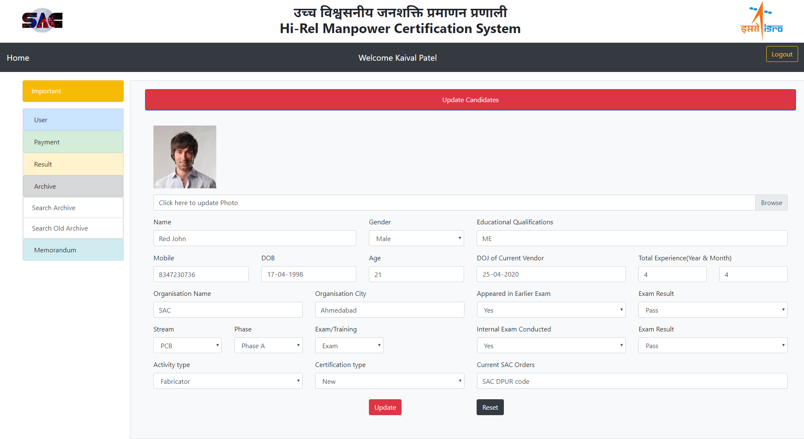

## Assign Exam Date

 This table is showed when candidate is registered in system and now exam/training commencing date will be assigned by the scientists.
 
  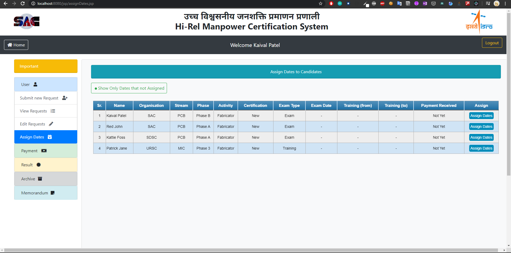

## Enter Payment

 Payment for exam/training for the appropriate Stream is provided by the company to the isro on behalf of their candidates in cheque/NEFT. Those details are entered here for the payment record
 
  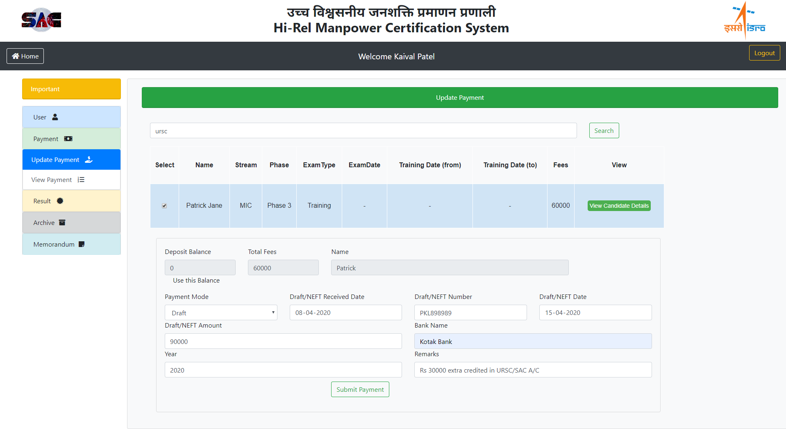

## Payment Details

 Pending and paid Payment details are shown as per the record of candidate
 
  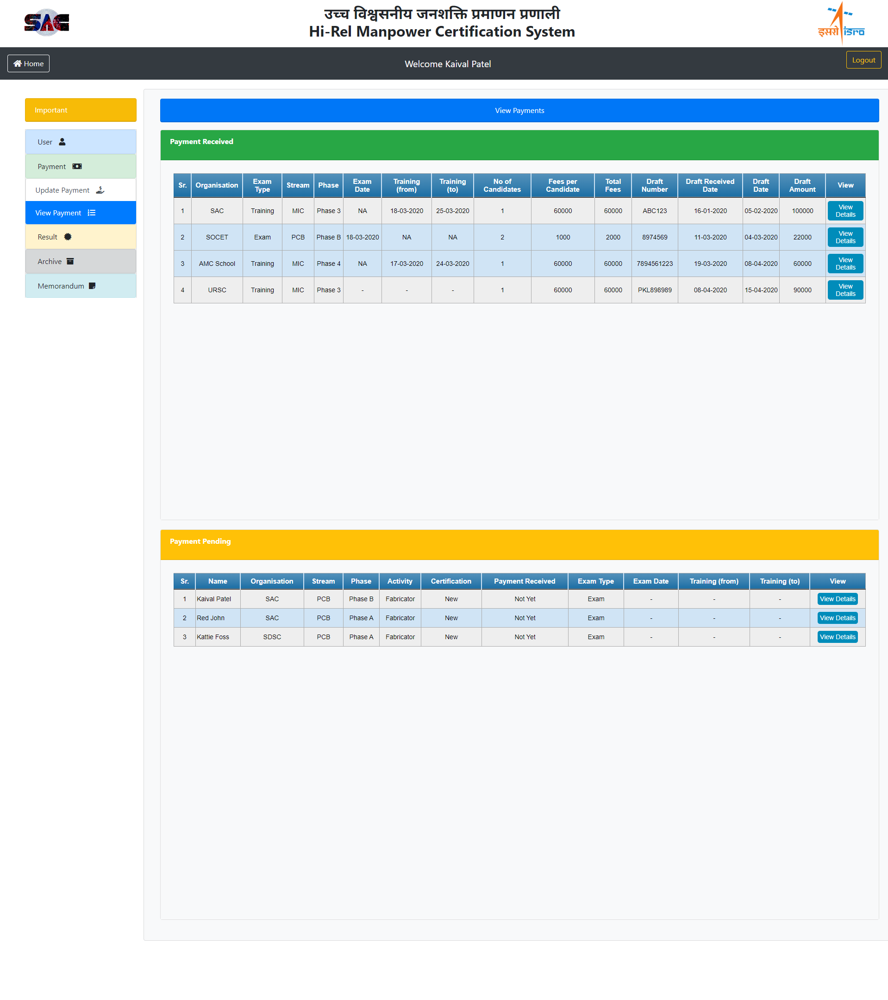

## Search

 Candidate can be searched here with several filters and views
 
  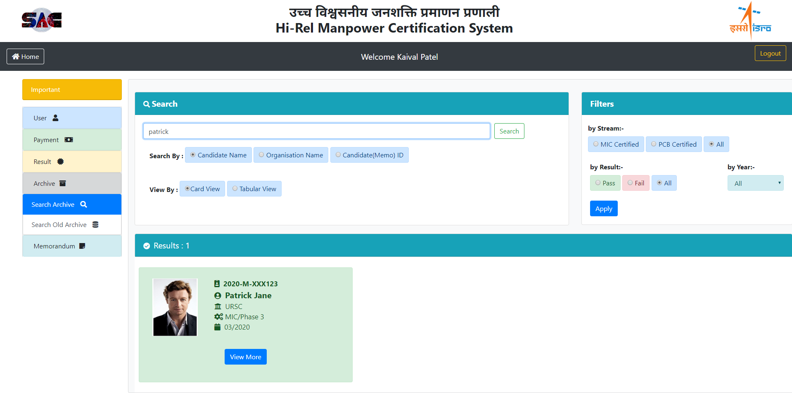

## View Searched Candidates

 On candidate search, a curative nice looking detailed view is shown displaying candidate information
 
  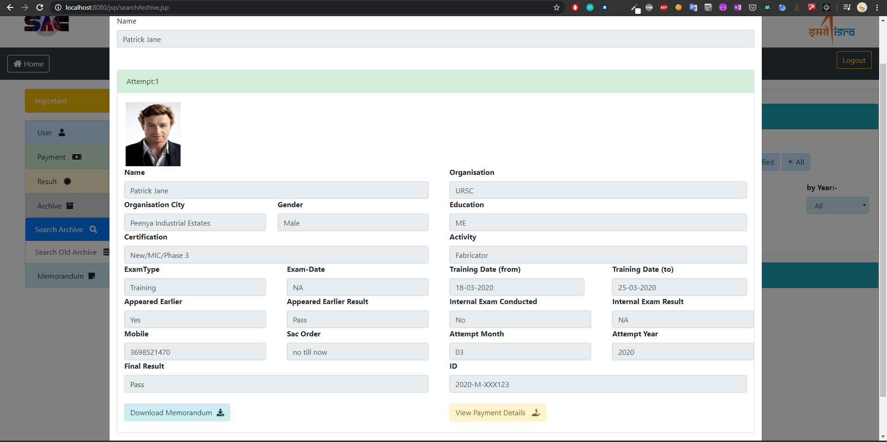

## Upload Result

 Candidate result if he/she is pass or fail in exam/training is entered in this section
 
  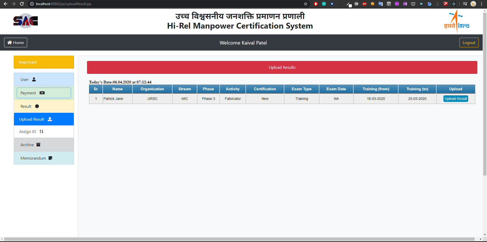

## Upload Memo

 A memorandum is generated by head scientist for the passed out candidates.In this screen the soft copy of memorandum will be uploaded to server
 
  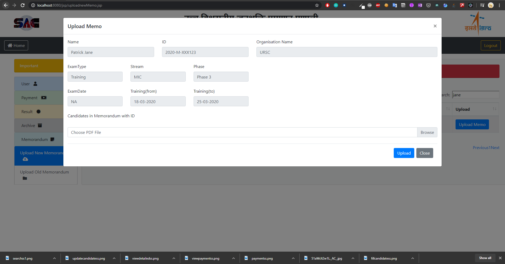

## Upload Memo Page

 This is the list of candidates which are passed but memorandum is still left to upload.
 
  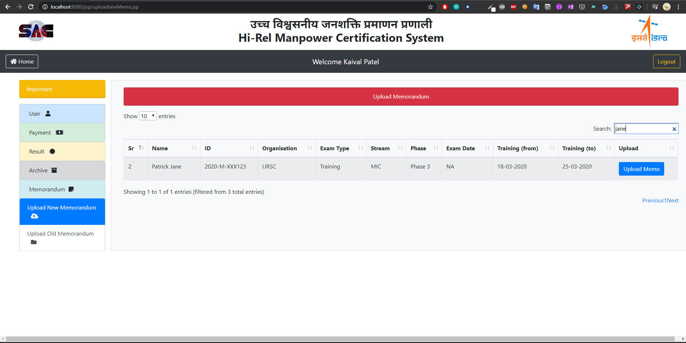

## Download Memo

 The memo which is uploaded in pdf format can same be viewed and downloaded from the server.
 
  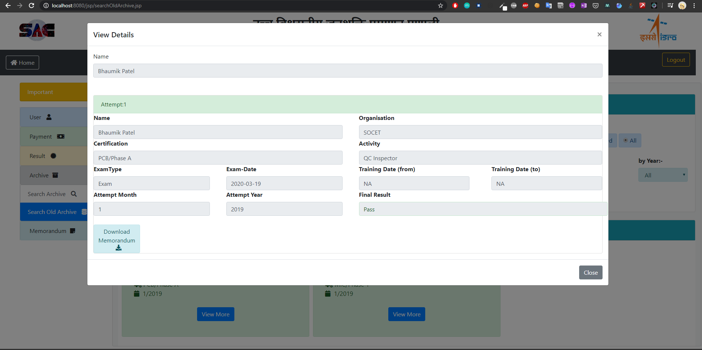

## Assign Id

 Outward number (from internal process) is given to each passed out candidates and failed candidates attempts are stored in the server
 
  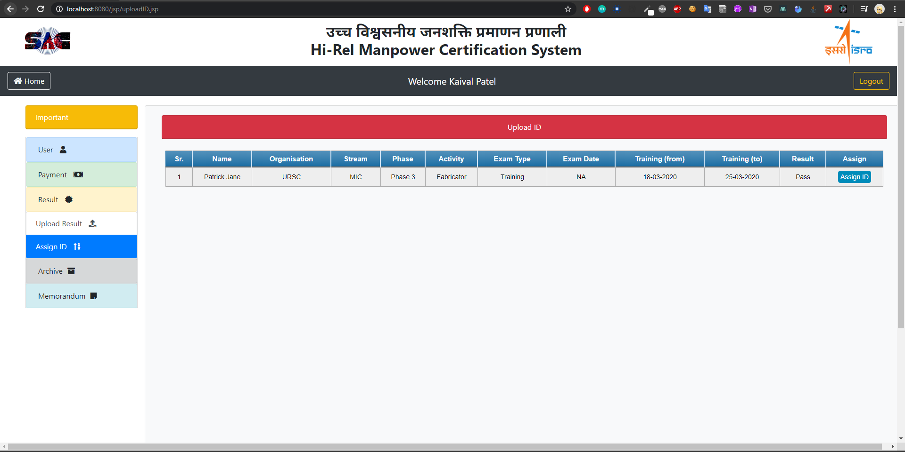

## Internship Certificate

 It was an awesome experience in a world's leading space agency
 
  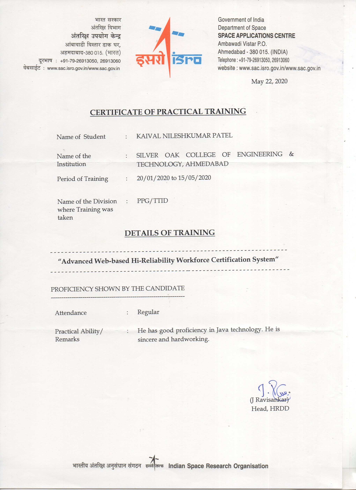

