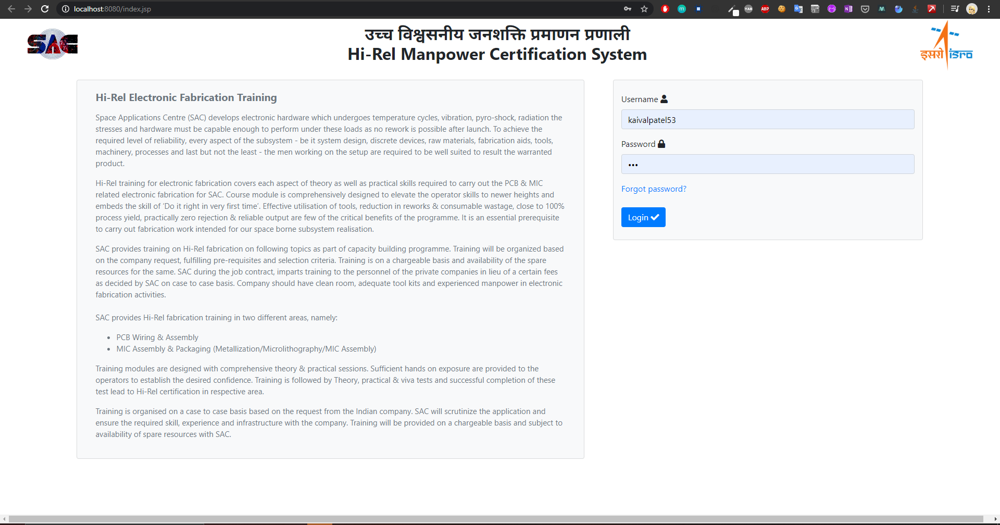
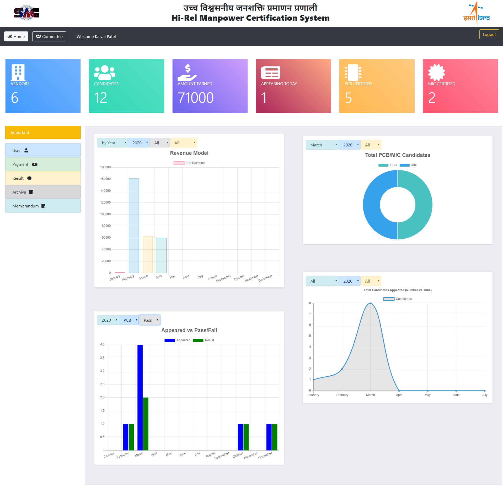
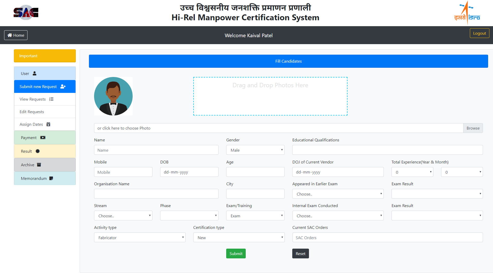

# About
This repo contains my isro internship project insights

### Table of Contents
1) [Login](#login)
2) [Dashboard](#dashboard)
3) [Register Candidate](#register-candidate)

## Login

 From this page, scientists will be able to login to our HRMCS portal, Inorder to register themselves, they have to contact admin section.
 
 

## Dashboard

 Created and developed this fabulous customisable dashboard with chartJS (library) and some css ingredients.
 
 

## Register Candidate

 Candidate form to add incoming outsourced candidates for the exam/training.
 
 

